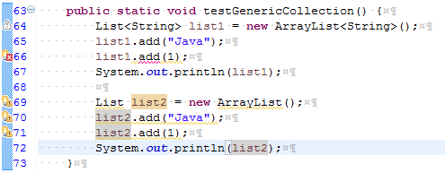

## Collection vs Collections
"Collection" và "Collections" trong java là hai khái niệm khác nhau.

> **Collections trong java** là một khuôn khổ cung cấp một kiến trúc để lưu trữ và thao tác tới nhóm các đối tượng. Tất cả các hoạt động mà bạn thực hiện trên một dữ liệu như tìm kiếm, phân loại, chèn, xóa,... có thể được thực hiện bởi Java Collections.

> **Collection trong java** là một root interface trong hệ thống cấp bậc Collection. Java Collection cung cấp nhiều interface (Set, List, Queue, Deque vv) và các lớp (ArrayList, Vector, LinkedList, PriorityQueue, HashSet, LinkedHashSet, TreeSet vv).

## Hệ thống cấp bậc Collection trong java
Gói java.util chứa tất cả các lớp và interface của Collection.


Collection có 5 interface chính
- **Set**: là một collection không thể chứa 2 giá trị trùng lặp. Set được sử dụng để biểu diễn các bộ, chẳng hạn như bộ tú lu khơ, thời khóa biểu của học sinh, các tiến trình đang chạy trên máy tính...
- **List**: là một collection có thứ tự (đôi khi còn được gọi là một chuỗi). List có thể chứa các phần tử trùng lặp. Thường có quyền kiểm soát chính xác vị trí các phần tử được chèn vào và có thể truy cập chúng bằng chỉ số (vị trí của chúng).
- **Queue (hàng đợi)**: là một collection được sử dụng để chứa nhiều phần tử trước khi xử lý. Bên cạnh các thao tác cơ bản của collection, Queue cung cấp các thao tác bổ sung như chèn, lấy ra và kiểm tra. Queue có thể được sử dụng như là FIFO (first-in, first-out - vào trước, ra trước)
- **Deque**: là một collection được sử dụng để chứa nhiều phần tử trước khi xử lý. Ngoài các thao tác cơ bản của collection, một Deque cung cấp các thao tác bổ sung như chèn, lấy ra và kiểm tra. Deques có thể được sử dụng như là FIFO (first-in, first-out - vào trước, ra trước) và LIFO (last-in, first-out - vào sau, ra trước). Trong một Deque, tất cả các phần tử mới có thể được chèn vào, lấy ra và lấy ra ở cả hai đầu.
- **Map**: là một đối tượng ánh xạ mỗi key tương úng với một giá trị. Map không thể chứa giá trị trùng lặp. Mỗi key có thể ánh xạ đến nhiều nhất một giá trị.

Dưới đây là mô tả 2 interface được sắp xếp của Set mà Map
- **SortedSet**: là một Set chứa các phần tử theo thứ tự tăng dần.
- **SortedMap**: là một Map chứa các phần tử được sắp xếp theo thứ tự tăng dần của key của chúng. Các SortedMap được sử dụng cho các collection theo thứ tự tự nhiên của cặp key/value, chẳng hạn như từ điển và danh bạ điện thoại.

## Iterable interface
**Iterable** interface chứa dữ liệu thành viên **Iterator** interface

Giao tiếp **Iterator** cung cấp phương tiện để lặp đi lặp lại các thành phần từ đầu đến cuối của một collection.

Chỉ có ba phương pháp trong giao tiếp Iterator như sau:
- **public boolean hasNext()** : Trả về true nếu iterator còn phần tử kế tiếp phần tử đang duyệt.
- **public object next()** : Trả về phần tử hiện tại và di chuyển con trỏ trỏ tới phần tử tiếp theo.
- **public void remove()** : Loại bỏ phần tử cuối được trả về bởi Iterator (hiếm khi được sử dụng).

## Các phương thức của interface Collection trong java
- **public boolean add(Object element)** : Được sử dụng để chèn một phần tử vào collection.
- **public boolean addAll(Collection c)** : Được sử dụng để chèn các phần tử collection được chỉ định vào collection gọi phương thức này.
- **public boolean remove(Object element)** : Được sử dụng để xóa phần tử từ collection.
- **public boolean removeAll(Collection c)** : Được sử dụng để xóa tất cả các phần tử của collection được chỉ định từ collection gọi phương thức này.
- **public boolean retainAll(Collection c)** : Được sử dụng để xóa tất cả các thành phần từ collection gọi phương thức này ngoại trừ collection được chỉ định.
- **public int size()** : Trả lại tổng số các phần tử trong collection.
- **public void clear()** : Loại bỏ tổng số của phần tử khỏi collection.
- **public boolean contains(Object element)** : Được sử dụng để tìm kiếm phần tử.
- **public boolean containsAll(Collection c)** : Được sử dụng để tìm kiếm collection được chỉ định trong collection.
- **public Iterator iterator()** : Trả về một iterator.
- **public Object[] toArray()** : Chuyển đổi collection thành mảng (array).
- **public boolean isEmpty()** : Kiểm tra nếu collection trống.
- **public boolean equals(Object element)** : So sanh 2 collection.
- **public int hashCode()** : Trả về số hashcode của collection.

>Ví dụ: 
```java
import java.util.ArrayList;
import java.util.HashMap;
import java.util.HashSet;
import java.util.LinkedList;
import java.util.List;
import java.util.Map;
import java.util.Set;
 
public class CollectionExample1 {
    public static void main(String[] args) {
        List<String> arrayList = new ArrayList<String>();
        arrayList.add("PHP");
        arrayList.add("Python");
        arrayList.add("Java");
        arrayList.add("C++");
        System.out.println("Các phần tử của ArrayList");
        System.out.print("\t" + arrayList + "\n");
 
        List<String> linkedList = new LinkedList<String>();
        linkedList.add("PHP");
        linkedList.add("Python");
        linkedList.add("Java");
        linkedList.add("C++");
        System.out.println("Các phần tử của LinkedList");
        System.out.print("\t" + linkedList + "\n");
 
        // new TreeSet() sẽ sắp xếp các phần tử
        Set<String> hashSet = new HashSet<String>();
        hashSet.add("PHP");
        hashSet.add("Python");
        hashSet.add("Java");
        hashSet.add("Java");
        hashSet.add("C++");
        System.out.println("Các phần tử của Set");
        System.out.print("\t" + hashSet + "\n");
 
        // new TreeMap() sẽ sắp xếp các phần tử dự vào key của chúng
        Map<String, String> hashMap = new HashMap<String, String>();
        hashMap.put("Windows", "2000");
        hashMap.put("Windows", "XP");
        hashMap.put("Language2", "Java");
        hashMap.put("Language1", ".Net");
        System.out.println("Các phần tử của Map");
        System.out.print("\t" + hashMap);
    }
}
```
```
Các phần tử của ArrayList
 [PHP, Python, Java, C++]
Các phần tử của LinkedList
 [PHP, Python, Java, C++]
Các phần tử của Set
 [Java, C++, PHP, Python]
Các phần tử của Map
 {Language1=.Net, Windows=XP, Language2=Java}
```

## Non-generic Collection và Generic Collection
Collection trong java là non-generic trước JDK 1.5. Từ JDK 1.5 là generic.

Generic Collection trong java cho phép chỉ có một kiểu đối tượng trong collection. Đây là một kiểu an toàn vì không cần phải ép kiểu tại runtime.

Ví dụ về non-generic collection - kiểu cũ và kiểu mới

```java
// Kiểu cũ
ArrayList list = new ArrayList();
// Kiểu mới
ArrayList<String> list = new ArrayList<String>(); 
```

Trong generic collection, chúng ta phải chỉ định kiểu dữ liệu được đặt trong <...>. Từ JDK 1.5, khi sử dụng ArrayList bắt buộc phải chỉ định kiểu dữ liệu cho nó. Nếu bạn cố gắng thêm một đối tượng có kiểu khác vào, chương trình sẽ báo lỗi compile-time.



## Duyệt các phần tử của collection
Có 2 cách để duyệt các phần tử của collection trong java.
1. Sử dụng Iterator interface.
2. Sử dụng vòng lặp for-each.

> Ví dụ 1: ArrayListExample1.java
```java
import java.util.ArrayList;
import java.util.Iterator;
 
public class ArrayListExample1 {
    public static void main(String args[]) {
        // Creating arraylist
        ArrayList<String> list = new ArrayList<String>();
        // Add objects to arraylist
        list.add("Java");
        list.add("C++");
        list.add("PHP");
        list.add("Java");
        // Show list through Iterator
        Iterator<String> itr = list.iterator();
        while (itr.hasNext()) {
            System.out.print(itr.next() + ", ");
        }
        // Show list through for-each
        System.out.println();
        for (String obj : list) {
            System.out.print(obj + ", ");
        }
        // Show list through index
        System.out.println();
        int size = list.size();
        for (int i = 0; i < size; i++) {
            System.out.print(list.get(i) + ", ");
        }
    }
}
```
```
Java, C++, PHP, Java, 
Java, C++, PHP, Java, 
Java, C++, PHP, Java, 
```
> Ví dụ 2: HashSetExample1.java
```java
import java.util.HashSet;
import java.util.Iterator;
import java.util.Set;
 
public class HashSetExample1 {
    public static void main(String[] args) {
        // Creating hashset
        Set<String> set = new HashSet<String>();
        // Add objects to hashset
        set.add("Java");
        set.add("C++");
        set.add("PHP");
        set.add("Java");
        // Show set through Iterator
        Iterator<String> itr = set.iterator();
        while (itr.hasNext()) {
            System.out.print(itr.next() + ", ");
        }
        // Show set through for-each
        System.out.println();
        for (String obj : set) {
            System.out.print(obj + ", ");
        }
    }
}
```
```
Java, C++, PHP, 
Java, C++, PHP, 
```
