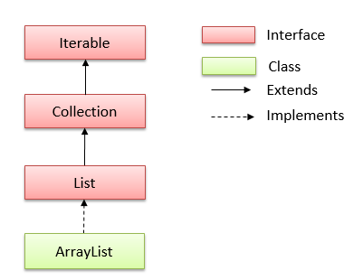

# ArrayList trong java
## Lớp ArrayList trong java
- Kế thừa (```extends```) **AbstractList**
- Triển khai (```implements```) của **List Interface** trong Collections Framework 
- Có một vài đặc điểm và phương thức tương đồng với List. 
- Được sử dụng như một mảng động để lưu trữ các phần tử.
- Có 2 kiểu khởi tạo ArrayList là non-generic và generic

> Lớp java.util.ArrayList được khai báo như sau:
```java
public class ArrayList<E> extends AbstractList<E>
        implements List<E>, RandomAccess, Cloneable, java.io.Serializable
```
> Khởi tạo ArrayList trong java
```java
ArrayList list = new ArrayList(); // non-generic - kiểu cũ
ArrayList<String> list = new ArrayList<String>(); // generic - kiểu mới
```

## Những điểm cần ghi nhớ về ArrayList:

- Lớp ArrayList trong java có thể chứa các phần tử trùng lặp.
- Lớp ArrayList duy trì thứ tự của phần tử được thêm vào.
- Lớp ArrayList là không đồng bộ (non-synchronized).
- Lớp ArrayList cho phép truy cập ngẫu nhiên vì nó lưu dữ liệu theo chỉ mục.
- Lớp ArrayList trong java, thao tác chậm vì cần nhiều sự dịch chuyển nếu bất kỳ phần tử nào bị xoá khỏi danh sách.

Hierarchy của lớp ArrayList trong java



## Các phương thức của ArrayList
- Constructor của lớp ArrayList
    - **ArrayList()**: Sử dụng để khởi tạo một danh sách mảng trống.
    - **ArrayList(Collection c)**: Sử dụng để xây dựng một danh sách mảng được khởi tạo với các phần tử của collection c.
    - **ArrayList(int capacity)**: Sử dụng để xây dựng một danh sách mảng mà có dung lượng ban đầu được chỉ định.

- **boolean add(Object o)** : Nối thêm phần tử được chỉ định vào cuối một danh sách.
- **void add(int index, Object element)** : Chèn phần tử element tại vị trí index vào danh sách.
- **boolean addAll(Collection c)** : Nối tất cả các phần tử trong collection c vào cuối của danh sách, theo thứ tự chúng được trả về bởi bộ lặp iterator.
- **boolean addAll(int index, Collection c)** : Chèn tất cả các phần tử trong collection c vào danh sách, bắt đầu từ vị trí index.
- **void retainAll(Collection c)** : Xóa những phần tử không thuộc collection c ra khỏi danh sách.
- **void removeAll(Collection c)** : Xóa những phần tử thuộc collection c ra khỏi danh sách.
- **int indexOf(Object o)** : Trả về chỉ mục trong danh sách với sự xuất hiện đầu tiên của phần tử được chỉ định, hoặc -1 nếu danh sách không chứa phần tử này.
- **int lastIndexOf(Object o)** : Trả về chỉ mục trong danh sách với sự xuất hiện cuối cùng của phần tử được chỉ định, hoặc -1 nếu danh sách không chứa phần tử này.
- **Object[] toArray()** : Trả về một mảng chứa tất cả các phần tử trong danh sách này theo đúng thứ tự.
- **Object[] toArray(Object[] a)** : Trả về một mảng chứa tất cả các phần tử trong danh sách này theo đúng thứ tự.
- **Object clone()** : Trả về một bản sao của ArrayList.
- **void clear()** : Xóa tất cả các phần tử từ danh sách này.
- **void trimToSize()** : Cắt dung lượng của thể hiện ArrayList này là kích thước danh sách hiện tại.
- **boolean contains(element)** : Kết quả trả về là ```true``` nếu tìm thấy element trong danh sách, ngược lại trả về ```false```.
