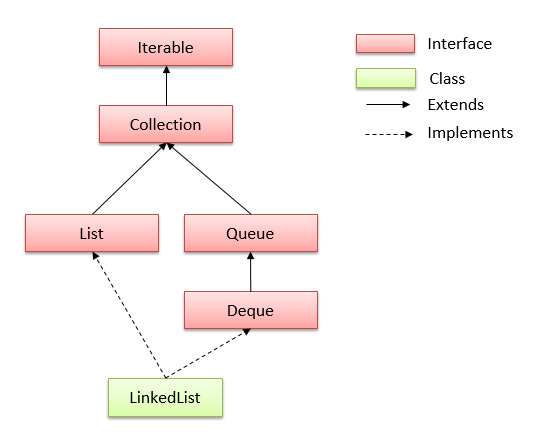

# LinkedList trong java
## Lớp LinkedList trong java
- Kế thừa (```extends```) **AbstractSequentialList**
- Triển khai (```implements```) của **List Interface** trong Collections Framework 
- Triển khai (```implements```) của **Queue Interface** trong Collections Framework 
- Có một vài đặc điểm và phương thức tương đồng với List.
- Sử dụng cấu trúc danh sách liên kết kép Doubly để lưu trữ các phần tử.
- Có 2 kiểu khởi tạo LinkedList là non-generic và generic

> Lớp java.util.LinkedList được khai báo như sau:
```java
public class LinkedList<E> extends AbstractSequentialList<E>
        implements List<E>, Deque<E>, Cloneable, java.io.Serializable
```

> Khởi tạo LinkedList trong java
```java
LinkedList list = new LinkedList(); // non-generic - kiểu cũ
LinkedList<String> list = new LinkedList<String>(); // generic - kiểu mới
```

## Những điểm cần ghi nhớ về lớp LinkedList:

- Lớp LinkedList trong java có thể chứa các phần tử trùng lặp.
- Lớp LinkedList duy trì thứ tự của phần tử được thêm vào.
- Lớp LinkedList là không đồng bộ (non-synchronized).
- Lớp LinkedList trong java có thể được sử dụng như list (danh sách), stack (ngăn xếp) hoặc queue (hàng đợi).
- Lớp LinkedList thao tác nhanh vì không cần phải dịch chuyển nếu bất kỳ phần tử nào bị xoá khỏi danh sách.

Hierarchy của lớp LinkedList trong java



## Các phương thức của lớp LinkedList trong java
- Constructor của lớp LinkedList
    - **LinkedList()**: Sử dụng để khởi tạo một danh sách mảng trống.
    - **LinkedList(Collection c)**: Sử dụng để xây dựng một danh sách chứa các phần tử của collection được chỉ định, theo thứ tự chúng được trả về bởi iterator của collection.
- **boolean add(Object o)** : Nối thêm phần tử được chỉ định vào cuối một danh sách.
- **void add(int index, Object element)** : Chèn phần tử element tại vị trí index vào danh sách.
- **void addFirst(Object o)**: Chèn phần tử được chỉ định vào đầu danh sách.
- **void addLast(Object o)**: Chèn phần tử được chỉ định vào cuối danh sách.
- **int size()**: Trả lại số lượng các phần tử trong một danh sách.
- **boolean contains(Object o)**: Trả về ```true``` nếu danh sách có chứa một phần tử được chỉ định.
- **boolean remove(Object o)**: Xóa phần tử được chỉ định đầu tiên trong một danh sách.
- **Object getFirst()**: Trả về phần tử đầu tiên trong một danh sách.
- **Object getLast()**: Trả lại phần tử cuối cùng trong một danh sách.
- **int indexOf(Object o)**: Trả về chỉ mục trong một danh sách với sự xuất hiện đầu tiên của phần tử được chỉ định, hoặc -1 nếu danh sách không chứa bất kỳ phần tử nào.
- **int lastIndexOf(Object o)**: Trả lại chỉ mục trong danh sách với sự xuất hiện cuối cùng của phần tử được chỉ định, hoặc -1 nếu danh sách không chứa bất kỳ phần tử nào.
- **boolean contains(element)**: Kết quả trả về là true nếu tìm thấy element trong danh sách, ngược lại trả về false.