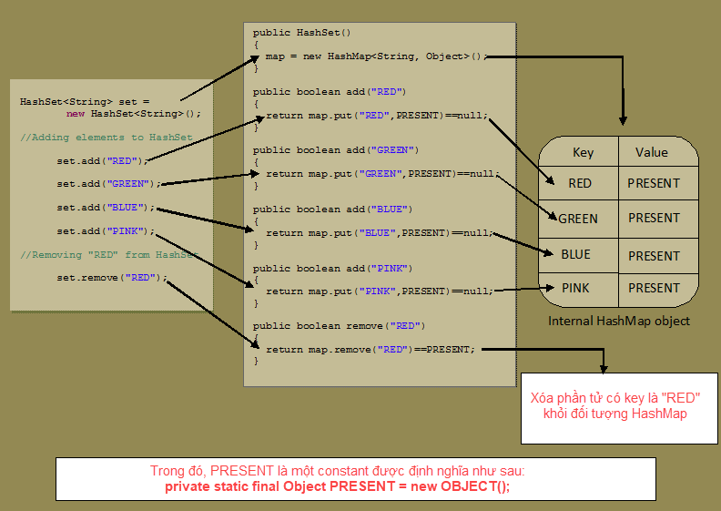
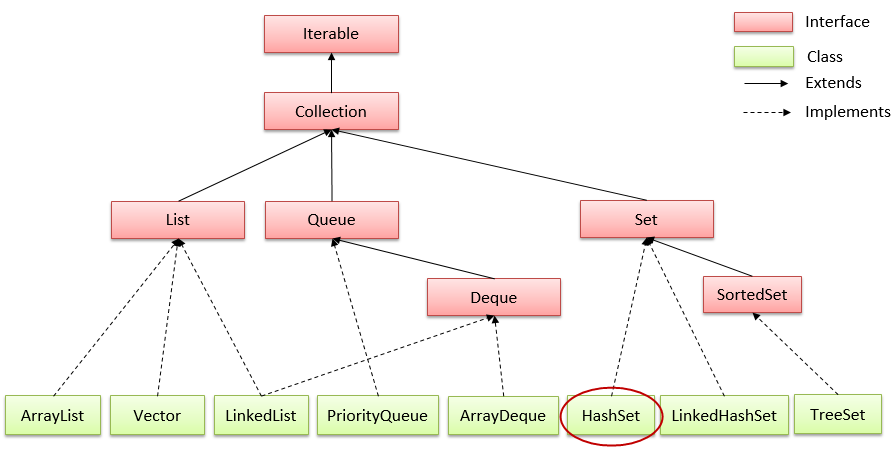

# HashSet trong Java

## Lớp HashSet trong java
- Kế thừa (```extends```) **AbstractSet**
- Triển khai (```implements```) của **Set** trong Collections Framework 
- Có một vài đặc điểm và phương thức tương đồng với Set. 
- HashSet được sử dụng để tạo một bộ sưu tập sử dụng bảng băm để lưu trữ.
- Có 2 kiểu khởi tạo HashSet

> Lớp java.util.HashSet được khai báo như sau:
```java
public class HashSet<E> extends AbstractSet<E>
        implements Set<E>, Cloneable, Serializable
```
> Khởi tạo ArrayList trong java
```java
Set setA = new HashSet();
HashSet setB = new HashSet();
```

## Những điểm cần ghi nhớ về HashSet:
- HashSet chỉ chứa các phần tử duy nhất.
- HashSet lưu trữ các phần tử bằng cách sử dụng một cơ chế được gọi là **băm** (hash table).
- Một **hash table** lưu giữ thông tin bởi sử dụng một kỹ thuật được gọi là **hashing** (băm). Trong hashing, nội dung mang tính thông tin của một **key** được sử dụng để quyết định một **value** duy nhất, được gọi là **hash code** của nó.
- **Hash code** sau đó được sử dụng như là **index**, tại đó dữ liệu mà liên kết với **key** được lưu giữ. Phép biến đổi của **key** vào trong **hash code** của nó được thực hiện tự động.



Hierarchy của lớp ArrayList trong java
Lớp HashSet extends lớp AbstractSet impliments giao diện Set. Giao diện Set kế thừa giao diện Collection và Iterable:



## Các phương thức của HashSet
- Constructor của lớp HashSet trong Java
    - **HashSet()**: Khởi tạo một HashSet trống có dung lượng ban đầu mặc định (16) và hệ số tải (0,75).
    - **HashMapHashSet(Collection c)**: Xây dựng một HashSet chứa collection c được chỉ định.
    - **HashSet(int initialCapacity)**: Xây dựng một HashSet trống với dung lượng ban đầu được chỉ định và hệ số tải mặc định là 0,75.
    - **HashSet(int initialCapacity, float loadFactor)**: Xây dựng HashSet trống có dung lượng ban đầu được chỉ định và hệ số tải được chỉ định.
- **boolean add(Object element)**: Chèn các phần tử vào HashSet.
- **boolean addAll(Collection c)**: Chèn tất cả các phần tử của c vào HashSet.
- **void clear()**: Xóa tất cả các phần tử khỏi HashSet.
- **boolean contains(Object element)**: Trả về true nếu tập hợp này chứa phần tử đã chỉ định.
- **boolean containsAll(Collection c)**: Trả về true nếu HashSet chứa tất cả các phần tử của collection c đã chỉ định.
- **boolean equals(Object o)**: So sánh các đối tượng được chỉ định với HashSet.
- **boolean isEmpty()**: Trả về true nếu HashSet không chứa phần tử.
- **int hashCode()**: Trả về giá trị mã băm
- **Iterator iterator()**: Trả về một trình vòng lặp iterator để duyệt qua các phần tử của HashSet.
- **boolean remove(Object o)**: Xóa phần tử đã chỉ định khỏi HashSet.
- **boolean removeAll(Collection c)**: Xóa khỏi HashSet tất cả các phần tử của nó được chứa trong collection c đã chỉ định.
- **boolean retainAll(Collection c)**: Chỉ giữ lại các phần tử trong HashSet được chứa trong collection c đã chỉ định.
- **int size()**: Trả về số lượng các phần tử của HashSet.
- **Object[] toArray()**: Trả về một mảng chứa tất cả các phần tử trong HashSet.
- **T[] toArray(T[] a)**: Trả về một mảng chứa tất cả các phần tử trong HashSet, kiểu run-time của mảng trả về là kiểu đã chỉ định.

> HashSet hoạt động thế nào: Tham khảo [https://viettuts.vn/java-collection/hashset-trong-java-hoat-dong-nhu-the-nao](https://viettuts.vn/java-collection/hashset-trong-java-hoat-dong-nhu-the-nao)