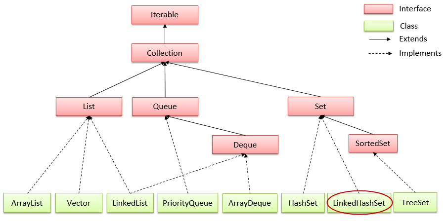

# LinkedHashSet trong java
## Lớp LinkedHashSet trong java
- Là một bản cài đặt bảng băm và danh sách liên kết 
- Triển khai (```implements```) của **Set** trong Collections Framework 

## Những điểm cần ghi nhớ về lớp LinkedHashSet:
- Chỉ chứa các phần tử duy nhất giống như HashSet.
- Cho phép các phần tử null.
- Duy trì thứ tự chèn.

Hierarchy của lớp LinkedList trong java


> Ví dụ 1: LinkedHashSet trong java với String:
```java
package vn.viettuts.collection;
 
import java.util.LinkedHashSet;
import java.util.Set;
 
public class LinkedHashSetExample1 {
    public static void main(String[] args) {
        // init set object
        Set<String> linkedHashSet = new LinkedHashSet<String>();
        linkedHashSet.add("Java");
        linkedHashSet.add("C++");
        linkedHashSet.add("Java");
        linkedHashSet.add("PHP");
        // show set
        for (String str : linkedHashSet) {
            System.out.println(str);
        }
    }
}
```
```
Java
C++
PHP
```

> Ví dụ 2: LinkedHashSet trong java với đối tượng Student:

```java
package vn.viettuts.collection;
 
import java.util.Iterator;
import java.util.LinkedHashSet;
 
/**
 * Student class
 * 
 * @author viettuts.vn
 */
class Student {
    private String name;
    private int age;
    private String address;
 
    public Student() {
    }
 
    public Student(String name, int age, String address) {
        super();
        this.name = name;
        this.age = age;
        this.address = address;
    }
 
    public String getName() {
        return name;
    }
 
    public void setName(String name) {
        this.name = name;
    }
 
    public int getAge() {
        return age;
    }
 
    public void setAge(int age) {
        this.age = age;
    }
 
    public String getAddress() {
        return address;
    }
 
    public void setAddress(String address) {
        this.address = address;
    }
 
    @Override
    public String toString() {
        return "Student@name=" + name + ",age=" + age + ",address=" + address;
    }
}
 
/**
 * LinkedHashSetExample2 class
 * 
 * @author viettuts.vn
 */
public class LinkedHashSetExample2 {
    public static void main(String[] args) {
        // init set
        LinkedHashSet<Student> set = new LinkedHashSet<Student>();
        // create students object
        Student student1 = new Student("Cong", 17, "Hanoi");
        Student student2 = new Student("Dung", 16, "Haiphong");
        Student student3 = new Student("Ngon", 18, "Hanoi");
        Student student4 = new Student("Hanh", 19, "Danang");
        // add students object to set
        set.add(student1);
        set.add(student2);
        set.add(student3);
        set.add(student4);
        set.add(student1);
        // show set
        Iterator<Student> iterator = set.iterator();
        Student student;
        while (iterator.hasNext()) {
            student = iterator.next();
            System.out.println(student.toString());
        }
    }
}
```
```
Student@name=Cong,age=17,address=Hanoi
Student@name=Dung,age=16,address=Haiphong
Student@name=Ngon,age=18,address=Hanoi
Student@name=Hanh,age=19,address=Danang
```