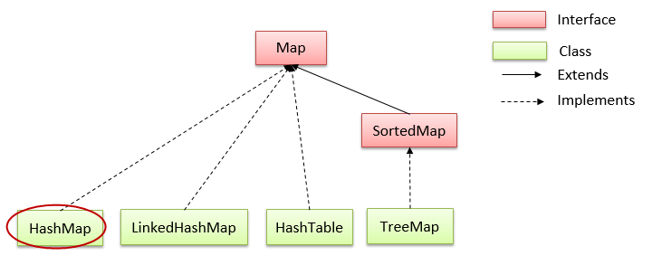

# HashMap trong Java

## Lớp HashMap trong java
- Kế thừa (```extends```) **AbstractMap**
- Triển khai (```implements```) của **Map** trong Collections Framework 
- Có một vài đặc điểm và phương thức tương đồng với Map. 
- HashMap được sử dụng để lưu trữ các phần tử dưới dạng "key/value".
- Có 2 kiểu khởi tạo HashMap

> Lớp java.util.HashMap được khai báo như sau:
```java
public class HashMap<K,V> extends AbstractMap<K,V>
    implements Map<K,V>, Cloneable, Serializable
```

## Những điểm quan trọng về lớp HashMap :
- HashMap lưu trữ dữ liệu dưới dạng cặp key và value.
- Nó chứa các key duy nhất.
- Nó có thể có 1 key là null và nhiều giá trị null.
- Nó duy trì các phần tử KHÔNG theo thứ tự.

Hierarchy của lớp HashMap trong Java
Lớp HashMap extends lớp AbstractMap và implements giao diện Map.



## Các phương thức của HashMap
- Constructor của lớp HashMap trong Java
    - **HashMap()**: Khởi tạo một HashMap trống.
    - **HashMap(int capacity, float loadFactor)**: Xây dựng một HashMap trống với dung lượng (capacity) ban đầu được chỉ định và hệ số tải (loadFactor) được chỉ định.
    - **HashMap(int capacity)**: Xây dựng một HashMap trống với dung lượng ban đầu được chỉ định và hệ số tải mặc định là 0,75.
    - **HashMap(Map t)**: Xây dựng HashMap mới với một Map đã cho.
- **void clear()**: Xóa tất cả các phần tử của HashMap.
- **Object clone()**: Trả về một bản copy của HashMap.
- **boolean containsKey(Object key)**: Trả về true nếu HashMap chứa một phần tử có key được chỉ định.
- **boolean containsValue(Object value)**: Trả về true nếu HashMap chứa một phần tử có giá trị (value) được chỉ định.
- **Set entrySet()**: Trả về Collection view các ánh xạ có trong HashMap.
- **Object get(Object key)**: Trả về giá trị của key được chỉ định.
- **boolean isEmpty()**: Trả về true nếu HashMap trống.
- **Set keySet()**: Trả về một Set interface chứa tất cả các key của HashMap.
- **Object put(Object key, Object value)**: Thêm một cặp key-value vào HashMap.
- **void putAll(Map t)**: Sao chép các phần tử của Map được chỉ định vào HashMap.
- **Object remove(Object key)**: Xóa một phần tử có key được chỉ định ra khởi HashMap.
- **int size()**: Trả về số phần tử của HashMap.
- **Collection values()**: Trả về Collection của các giá trị có trong HashMap.

> HashMap hoạt động thế nào: Tham khảo [https://viettuts.vn/java-collection/hashmap-trong-java-hoat-dong-nhu-the-nao](https://viettuts.vn/java-collection/hashmap-trong-java-hoat-dong-nhu-the-nao)