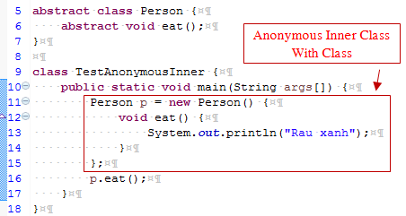
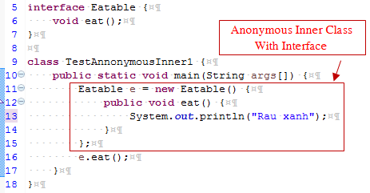

# Anonymous inner class trong java

## Định nghĩa
Một lớp mà không có tên được gọi là lớp vô danh trong java hay anonymous inner class trong java. Nó nên được sử dụng nếu bạn phải ghi đè phương thức của lớp hoặc interface. Anonymous inner class có thể được tạo ra bằng hai cách:
- Class (có thể là abstract hoặc cụ thể).
- Interface

## Ví dụ về anonymous inner class trong java với Class


```
Rau xanh
```

#### Hoạt động nội bộ của đoạn code trên
```java
Person p = new Person() {
    void eat() {
        System.out.println("Rau xanh");
    }
};
```
- Một lớp được tạo ra nhưng tên của nó được quyết định bởi trình biên dịch mà extends lớp Person và cung cấp việc cài đặt phương thức eat().
- Một đối tượng của lớp Anonymous được tạo ra mà được gọi bằng biến tham chiếu p của kiểu Person.

#### Lớp nội bộ được tạo ra bởi trình biên dịch
```java
import java.io.PrintStream;
 
static class TestAnonymousInner$1 extends Person {
    TestAnonymousInner$1() {
    }
 
    void eat() {
        System.out.println("Rau xanh");
    }
}
```

## Ví dụ về anonymous inner class trong java với Interface



```
Rau xanh
```

#### Hoạt động nội bộ của đoạn code trên

```java
Eatable e = new Eatable() {
    public void eat() {
        System.out.println("Rau xanh");
    }
};
```
- Một lớp được tạo ra nhưng tên của nó được quyết định bởi trình biên dịch mà extends interface Eatable và cung cấp việc cài đặt phương thức eat().
- Một đối tượng của lớp Anonymous được tạo ra mà được gọi bằng biến tham chiếu e của kiểu Eatable.

#### Lớp nội bộ được tạo ra bởi trình biên dịch
```java
import java.io.PrintStream;
 
static class TestAnonymousInner1$1 implements Eatable {
    TestAnonymousInner1$1() {
    }
 
    void eat() {
        System.out.println("Rau xanh");
    }
}
```