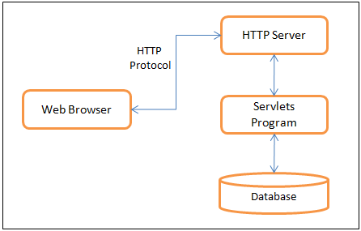

# Giới thiệu Servlet
- Công nghệ Servlet được sử dụng để tạo ra ứng dụng web (nằm ở phía máy chủ và tạo ra trang web động).
- Sử dụng Servlet, bạn có thể thu thập thông tin đầu vào từ người dùng thông qua các trang web, hiển thị các bản ghi từ một cơ sở dữ liệu hoặc một nguồn khác.

## Servlet là gì?
Servlet có thể được mô tả bằng nhiều cách, tùy thuộc vào ngữ cảnh:
- Servlet là một công nghệ được sử dụng để tạo ra ứng dụng web.
- Servlet là một API cung cấp các interface và lớp bao gồm các tài liệu.
- Servlet là một thành phần web được triển khai trên máy chủ để tạo ra trang web động.

Có nhiều interface và các lớp trong API servlet như Servlet, GenericServlet, HttpServlet, ServletRequest, ServletResponse, ...

## Kiến trúc servlet
Sơ đồ dưới đây cho thấy vị trí của Servlets trong một Ứng dụng Web.

## Nhiệm vụ của Servlet
Servlet thực hiện các nhiệm vụ chính sau đây:
- Đọc dữ liệu rõ ràng do khách hàng (trình duyệt) gửi. Điều này bao gồm một mẫu HTML trên một trang Web hoặc nó cũng có thể đến từ một applet hoặc một chương trình khách hàng HTTP tùy chỉnh.
- Đọc dữ liệu yêu cầu HTTP ẩn được gửi bởi khách hàng (trình duyệt). Điều này bao gồm các cookie, loại phương tiện truyền thông và các chương trình nén mà trình duyệt hiểu được, v.v.
- Xử lý dữ liệu và tạo ra các kết quả. Quá trình này có thể yêu cầu nói chuyện với một cơ sở dữ liệu, thực hiện một cuộc gọi RMI hoặc CORBA, gọi một dịch vụ Web, hoặc tính trực tiếp phản hồi.
- Gửi dữ liệu rõ ràng (tức là tài liệu) tới khách hàng (trình duyệt). Tài liệu này có thể được gửi bằng nhiều định dạng, bao gồm văn bản (HTML hoặc XML), nhị phân (hình ảnh GIF), Excel, v.v ...
- Gửi phản hồi HTTP ẩn cho khách hàng (trình duyệt). Điều này bao gồm nói với trình duyệt hoặc các trình khách khác loại tài liệu đang được trả về (ví dụ, HTML), thiết lập cookie và các tham số bộ nhớ đệm, và các tác vụ khác.

## Gói Servlet
Java Servlets là các lớp Java chạy bởi một máy chủ web có một trình thông dịch hỗ trợ đặc tả Java Servlet.

Servlets có thể được tạo ra bằng cách sử dụng các gói javax.servlet và javax.servlet.http , đây là một phần chuẩn của phiên bản Enterprise của Java, một phiên bản mở rộng của thư viện lớp Java hỗ trợ các dự án phát triển quy mô lớn.

Các lớp này thực hiện các đặc tả Java Servlet và JSP.

Các servlet Java đã được tạo ra và biên dịch giống như các lớp Java khác. Sau khi cài đặt gói servlet và thêm chúng vào Classpath của máy tính, bạn có thể biên dịch các servlet bằng trình dịch Java của JDK hoặc bất kỳ trình biên dịch hiện tại nào khác.

## Nhược điểm của Servlet
Bạn phải viết code java + html trong cùng một file tạo cảm giác rối rắm.

## Tại sao bạn nên biết Servlet
- Nếu bạn đang đi theo hướng java web thì bạn nên biết về servlet vì nó là core của java web.
- Nhưng bạn chỉ cần học servlet ở mức độ biết là đủ, không cần đi sâu. Vì hiện nay có khá nhiều framework mạnh mẽ được sử dụng để tạo ra một trang web bằng java. Như Spring MVC Web, Struts, ...