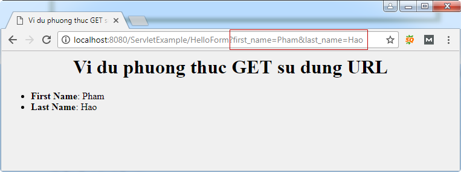
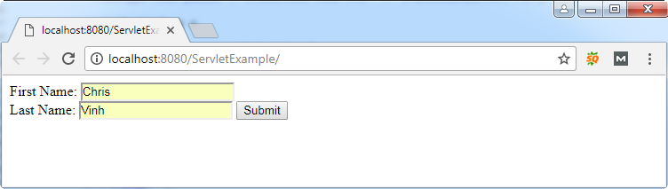

### Ví dụ phương thức GET sử dụng URL
Tạo servlet HelloForm để xử lý yêu cầu từ máy khách.
File: HelloForm.java trong package vn.viettuts
```java
package vn.viettuts;
 
import java.io.IOException;
import java.io.PrintWriter;
 
import javax.servlet.ServletException;
import javax.servlet.http.HttpServlet;
import javax.servlet.http.HttpServletRequest;
import javax.servlet.http.HttpServletResponse;
 
public class HelloForm extends HttpServlet {
     
    /**
     * Xử lý phương thức GET
     */
    public void doGet(HttpServletRequest request, HttpServletResponse response)
            throws ServletException, IOException {
             
        // Set response content type
        response.setContentType("text/html");
 
        PrintWriter out = response.getWriter();
        String title = "Vi du phuong thuc GET su dung URL";
        String docType =
           "<!doctype html public \"-//w3c//dtd html 4.0 " + 
           "transitional//en\">\n";
            
        out.println(docType +
           "<html>\n" +
              "<head><meta charset=\"UTF-8\">\n" +
              "<title>" + title + "</title></head>\n" +
              "<body bgcolor = \"#f0f0f0\">\n" +
                 "<h1 align = \"center\">" + title + "</h1>\n" +
                 "<ul>\n" +
                    "  <li><b>First Name</b>: "
                    + request.getParameter("first_name") + "\n" +
                    "  <li><b>Last Name</b>: "
                    + request.getParameter("last_name") + "\n" +
                 "</ul>\n" +
              "</body>" + 
           "</html>"
        );
     }
}
```
Cấu hình servlet trong file web.xml

```xml
<servlet>
  <servlet-name>HelloForm</servlet-name>
  <servlet-class>vn.viettuts.HelloForm</servlet-class>
</servlet>
 
<servlet-mapping>
  <servlet-name>HelloForm</servlet-name>
  <url-pattern>/HelloForm</url-pattern>
</servlet-mapping>
```

Demo



### Ví dụ phương thức GET sử dụng Form
Tạo servlet HelloForm để xử lý yêu cầu từ máy khách.

File: HelloForm.java trong package vn.viettuts
```java
package vn.viettuts;
 
import java.io.IOException;
import java.io.PrintWriter;
 
import javax.servlet.ServletException;
import javax.servlet.http.HttpServlet;
import javax.servlet.http.HttpServletRequest;
import javax.servlet.http.HttpServletResponse;
 
public class HelloForm extends HttpServlet {
     
    /**
     * Xử lý phương thức GET
     */
    public void doGet(HttpServletRequest request, HttpServletResponse response)
            throws ServletException, IOException {
             
        // Set response content type
        response.setContentType("text/html");
 
        PrintWriter out = response.getWriter();
        String title = "Vi du phuong thuc GET su dung Form";
        String docType =
           "<!doctype html public \"-//w3c//dtd html 4.0 " + 
           "transitional//en\">\n";
            
        out.println(docType +
           "<html>\n" +
              "<head><meta charset=\"UTF-8\">\n" +
              "<title>" + title + "</title></head>\n" +
              "<body bgcolor = \"#f0f0f0\">\n" +
                 "<h1 align = \"center\">" + title + "</h1>\n" +
                 "<ul>\n" +
                    "  <li><b>First Name</b>: "
                    + request.getParameter("first_name") + "\n" +
                    "  <li><b>Last Name</b>: "
                    + request.getParameter("last_name") + "\n" +
                 "</ul>\n" +
              "</body>" + 
           "</html>"
        );
     }
}
```
Cấu hình servlet trong file web.xml
```xml
<servlet>
  <servlet-name>HelloForm</servlet-name>
  <servlet-class>vn.viettuts.HelloForm</servlet-class>
</servlet>
 
<servlet-mapping>
  <servlet-name>HelloForm</servlet-name>
  <url-pattern>/HelloForm</url-pattern>
</servlet-mapping>
```
Tạo trang index.html

```html
<!DOCTYPE html>
<html>
<head>
<meta charset="UTF-8">
</head>
<body>
  <form action="HelloForm" method="GET">
    First Name: <input type="text" name="first_name"> <br />
    Last Name: <input type="text" name="last_name" /> 
    <input type="submit" value="Submit" />
  </form>
</body>
</html>
```

Demo



Click Submit


