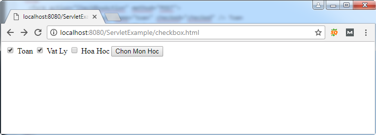
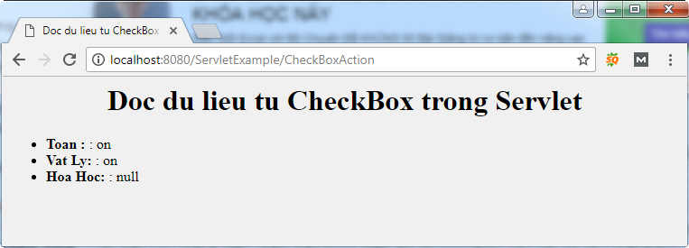

### Ví dụ truyền dữ liệu CheckBox trong Servlet

Tạo servlet CheckBoxAction để xử lý yêu cầu từ máy khách.

File: CheckBoxAction .java trong package vn.viettuts

```java
package vn.viettuts;
 
import java.io.IOException;
import java.io.PrintWriter;
 
import javax.servlet.ServletException;
import javax.servlet.http.HttpServlet;
import javax.servlet.http.HttpServletRequest;
import javax.servlet.http.HttpServletResponse;
 
public class CheckBoxAction extends HttpServlet {
     
    /**
     * Xu ly GET request
     */
    public void doGet(HttpServletRequest request, HttpServletResponse response)
       throws ServletException, IOException {
        
       // Set response content type
       response.setContentType("text/html");
 
       PrintWriter out = response.getWriter();
       String title = "Doc du lieu tu CheckBox trong Servlet";
       String docType =
          "<!doctype html public \"-//w3c//dtd html 4.0 " + 
          "transitional//en\">\n";
 
       out.println(docType +
          "<html>\n" +
             "<head><title>" + title + "</title></head>\n" +
             "<body bgcolor = \"#f0f0f0\">\n" +
                "<h1 align = \"center\">" + title + "</h1>\n" +
                "<ul>\n" +
                   "  <li><b>Toan : </b>: "
                   + request.getParameter("toan") + "\n" +
                   "  <li><b>Vat Ly: </b>: "
                   + request.getParameter("ly") + "\n" +
                   "  <li><b>Hoa Hoc: </b>: "
                   + request.getParameter("hoa") + "\n" +
                "</ul>\n" +
             "</body>" +
          "</html>"
       );
    }
 
    /**
     * Xu ly POST request
     */
    public void doPost(HttpServletRequest request, HttpServletResponse response)
       throws ServletException, IOException {
        
       doGet(request, response);
    }
 }
```

Cấu hình servlet trong file web.xml

```xml
<servlet>
  <servlet-name>CheckBoxAction</servlet-name>
  <servlet-class>vn.viettuts.CheckBoxAction</servlet-class>
</servlet>
 
<servlet-mapping>
  <servlet-name>CheckBoxAction</servlet-name>
  <url-pattern>/CheckBoxAction</url-pattern>
</servlet-mapping>
```

Tạo trang checkbox.html

```html
<!DOCTYPE html>
<html>
<head>
<meta charset="UTF-8">
</head>
<body>
  <form action="CheckBoxAction" method="POST">
    <input type="checkbox" name="toan" checked="checked" /> Toan 
    <input type="checkbox" name="ly" /> Vat Ly
    <input type="checkbox" name="hoa" /> Hoa Hoc
    <input type="submit" value="Chon Mon Hoc" />
  </form>
</body>
</html>
```

Demo



Click "Chon Mon Hoc"

