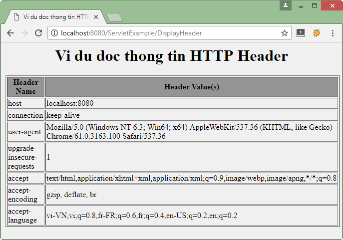

# Request trong Servlet
Khi trình duyệt gửi yêu cầu (request) đến một trang web. Nó gửi rất nhiều thông tin đến web server nhưng những thông tin này không thể đọc trực tiếp vì chúng là một phần của Header của HTTP request.

## Các phương thức để đọc HTTP Header
Các phương thức sau đây có thể được sử dụng để đọc HTTP Header trong chương trình servlet của bạn. Các phương thức này có sẵn trong đối tượng HttpServletRequest.

- **Cookie [] getCookies()**: Trả về mảng chứa tất cả các đối tượng Cookie mà client gửi với request này.
- **Enumeration getAttributeNames()**: Trả về một Enumeration chứa tên của các thuộc tính có sẵn cho request này.
- **Enumeration getHeaderNames()**: Trả về một đếm tất cả tên tiêu đề request này.
- **Enumeration getParameterName()**: Trả về một Enumeration of String các đối tượng có chứa tên của các tham số chứa trong request này.
- **HttpSession getSession()**: Trả về phiên hiện tại được kết hợp với request này, hoặc nếu request không có phiên, hãy tạo một phiên.
- **HttpSession getSession** (tạo boolean): Trả về HttpSession hiện tại được liên kết với request này hoặc, nếu không có phiên hiện tại và giá trị của create là đúng, trả về một phiên mới.
- **Locale getLocale()**: Trả về ngôn ngữ ưu tiên mà client sẽ chấp nhận nội dung, dựa trên tiêu đề Accept-Language.
-**Đối tượng getAttribute (String name)**: Trả về giá trị của thuộc tính được đặt tên như một đối tượng, hoặc null nếu không có thuộc tính của tên đã cho tồn tại.
-**ServletInputStream getInputStream()**: Truy cập body của request dưới dạng dữ liệu nhị phân bằng ServletInputStream.
- **String getAuthType()**: Trả về tên của lược đồ xác thực được sử dụng để bảo vệ servlet, ví dụ như "BASIC" hoặc "SSL" hoặc null nếu JSP không được bảo vệ.
- **Chuỗi getCharacterEncoding()**: Trả về tên của mã hoá ký tự được sử dụng trong phần thân request này.
- **String getContentType()**: Trả về kiểu MIME của body request, hoặc null nếu loại không được biết.
- **String getContextPath()**: Trả về phần của URI request chỉ ra ngữ cảnh của request.
- **String getHeader(String name)**: Trả về giá trị của tiêu đề request được chỉ định như là một Chuỗi.
- **Chuỗi getMethod()**:Trả về tên của phương thức HTTP mà request này được thực hiện, ví dụ như GET, POST, hoặc PUT.
- **String getParameter(String name)**:Trả về giá trị của tham số request như một String, hoặc null nếu tham số không tồn tại.
- **Chuỗi getPathInfo()**:Trả về bất kỳ thông tin đường dẫn bổ sung liên quan đến URL mà client gửi khi thực hiện request này.
- **Chuỗi getProtocol()**:Trả về tên và phiên bản của giao thức theo request.
- **Chuỗi getQueryString()**: Trả về chuỗi truy vấn được chứa trong URL request sau đường dẫn.
- **Chuỗi getRemoteAddr()**: Trả về địa chỉ Giao thức Internet (IP) của client gửi request.
- **Chuỗi getRemoteHost()**: Trả về tên đầy đủ của client đã gửi request.
- **Chuỗi getRemoteUser()**: Trả về thông tin đăng nhập của người dùng request này, nếu người dùng đã được xác thực, hoặc null nếu người dùng không được xác thực.
- **Chuỗi getRequestURI()**: Trả về một phần của URL của request này từ tên giao thức cho đến chuỗi truy vấn trong dòng đầu tiên của request HTTP.
- **Chuỗi getRequestedSessionId()**: Trả về ID phiên xác định bởi client.
- **Chuỗi getServletPath()**: Trả về một phần của URL của request này gọi là JSP.
- **String[] getParameterValues(String name)**: Trả về một mảng các đối tượng String chứa tất cả các giá trị mà tham số request cho trước có, hoặc null nếu tham số không tồn tại.
- **boolean isSecure()**: Trả về một Boolean cho biết request này được thực hiện bằng một kênh an toàn, chẳng hạn như HTTPS.
- **int getContentLength()**: Trả về chiều dài, theo byte, của thân request và được cung cấp bởi luồng đầu vào, hoặc -1 nếu chiều dài không được biết.
- **int getIntHeader(String name)**: Trả về giá trị của tiêu đề request được chỉ định như là một int.
- **int getServerPort()**: Trả về số cổng mà request này đã nhận được.

### Ví dụ đọc HTTP Header với request trong servlet
Sau đây là ví dụ sử dụng phương thức getHeaderNames() của HttpServletRequest để đọc thông tin HTTP Header. Phương thức này trả về một Enumeration chứa thông tin header liên quan đến HTTP Request hiện tại.

Với Enumeration, chúng ta có thể lặp Enumeration theo cách chuẩn, sử dụng phương thức hasMoreElements() để xác định khi nào dừng lại và sử dụng phương thức nextElement() để lấy từng tên tham số.

Tạo file DisplayHeader.java
```java
package vn.viettuts;
 
import java.io.IOException;
import java.io.PrintWriter;
import java.util.Enumeration;
 
import javax.servlet.ServletException;
import javax.servlet.http.HttpServlet;
import javax.servlet.http.HttpServletRequest;
import javax.servlet.http.HttpServletResponse;
 
public class DisplayHeader extends HttpServlet {
     
    // Method to handle GET method request.
    public void doGet(HttpServletRequest request, HttpServletResponse response)
            throws ServletException, IOException {
 
        // Set response content type
        response.setContentType("text/html");
   
        PrintWriter out = response.getWriter();
        String title = "Vi du doc thong tin HTTP Header";
        String docType = "<!doctype html public \"-//w3c//dtd html 4.0 "
                + "transitional//en\">\n";
 
        out.println(docType + "<html>\n" + "<head><title>" + title 
                + "</title></head>\n"
                + "<body bgcolor = \"#f0f0f0\">\n"
                + "<h1 align = \"center\">" + title + "</h1>\n"
                + "<table width = \"100%\" border = \"1\" align = \"center\">\n"
                + "<tr bgcolor = \"#949494\">\n"
                + "<th>Header Name</th><th>Header Value(s)</th>\n"
                + "</tr>\n");
   
        // get header names
        Enumeration headerNames = request.getHeaderNames();
 
        while (headerNames.hasMoreElements()) {
            String paramName = (String) headerNames.nextElement();
            out.print("<tr><td>" + paramName + "</td>\n");
            String paramValue = request.getHeader(paramName);
            out.println("<td> " + paramValue + "</td></tr>\n");
        }
        out.println("</table>\n</body></html>");
    }
     
    // Method to handle POST method request.
    public void doPost(HttpServletRequest request, HttpServletResponse response)
       throws ServletException, IOException {
 
       doGet(request, response);
    }
 }
```

Cấu hình servlet DisplayHeader trong file web.xml

```xml
<servlet>
    <servlet-name>DisplayHeader</servlet-name>
    <servlet-class>vn.viettuts.DisplayHeader</servlet-class>
</servlet>
 
<servlet-mapping>
    <servlet-name>DisplayHeader</servlet-name>
    <url-pattern>/DisplayHeader</url-pattern>
</servlet-mapping>
```

Gọi servlet trên sẽ tạo ra kết quả sau:

