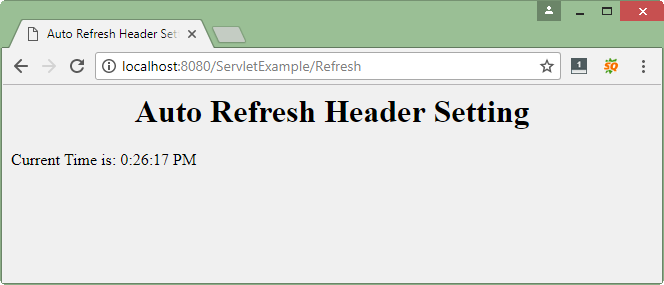

# Response trong Servlet
Khi Web server đáp ứng (response) yêu cầu của HTTP request. Một response thông thường bao gồm trạng thái (status), header, blank line, và document.

```
HTTP/1.1 200 OK
Content-Type: text/html
Header2: ...
...
HeaderN: ...
   (Blank Line)
<!doctype ...>
<html>
   <head>...</head>
   <body>
      ...
   </body>
</html>
```

Dòng trạng thái (status) bao gồm: phiên bản HTTP (trong ví dụ là HTTP / 1.1), mã trạng thái (trong ví dụ là 200) và một thông báo rất ngắn tương ứng với mã trạng thái (trong ví dụ là OK).

## Các phương thức để set HTTP Header response trong servlet
Các phương thức sau đây có thể được sử dụng để set HTTP Header response trong chương trình servlet của bạn. Các phương pháp này có sẵn trong đối tượng **HttpServletResponse**.

- **String encodeRedirectURL(String url)**:Mã hóa URL đã chỉ định để sử dụng trong phương thức sendRedirect hoặc, nếu mã hoá không cần thiết, sẽ trả về URL không thay đổi.
- **String encodeURL(String url)**:Mã hoá URL đã chỉ định bằng cách bao gồm ID phiên đó, hoặc, nếu mã hoá không cần thiết, trả về URL không thay đổi.
- **boolean containsHeader(String name)**:Trả về một Boolean cho biết header response đã được đặt chưa.
- **boolean isCommitted()**:Trả về một Boolean chỉ ra nếu đáp ứng đã được thực hiện.
- **void addCookie(Cookie cookie)**:Thêm cookie được chỉ định vào câu trả lời.
- **void addDateHeader(String name, long date)**:Thêm một header đáp ứng với tên và giá trị ngày.
- **void addHeader(String name, String value)**:Thêm một header đáp ứng với tên và giá trị đã cho.
- **void addIntHeader(String name, int value)**:Thêm một header đáp ứng với tên và giá trị số nguyên.
- **void flushBuffer()**:Buộc bất kỳ nội dung nào trong bộ đệm sẽ được ghi vào máy khách.
- **void reset()**:Xóa bất kỳ dữ liệu nào tồn tại trong bộ đệm cũng như mã trạng thái và header.
- **void resetbuffer()**:Xóa nội dung của bộ đệm cơ bản trong response mà không có header xoá hoặc mã trạng thái.
- **void sendError(int sc)**:Gây response lỗi tới máy khách bằng cách sử dụng mã trạng thái được chỉ định và xóa bộ đệm.
- **void sendError(int sc, String msg)**:Gửi response lỗi đến máy khách sử dụng trạng thái được chỉ định.
- **void sendRedirect(String location)**:Gửi response chuyển hướng tạm thời tới khách hàng bằng cách sử dụng URL vị trí chuyển hướng được chỉ định.
- **void setBufferSize(int size)**:Thiết lập kích thước bộ đệm cho response.
- **void setCharacterEncoding(String charset)**:Thiết lập mã hoá ký tự(ký tự MIME) của câu trả lời được gửi tới khách hàng, ví dụ như để UTF-8.
- **void setContentLength(int len)**:Đặt độ dài của nội dung trong response Trong HTTP servlet, phương pháp này đặt header HTTP Content-Length.
- **void setContentLength(int len)**:Thiết lập kiểu nội dung của câu trả lời được gửi đến khách hàng, nếu chưa trả lời.
- **void setContentType(String type)**:Thiết lập một header đáp ứng với tên và giá trị ngày. .
- **void setHeader(String name, String value)**:Đặt header response với tên và giá trị đã cho.
- **void setIntHeader(String name, int value)**:Thiết lập header đáp ứng với tên và giá trị số đã cho.
- **void setLocale(Locale loc)**:Đặt vị trí của câu trả lời, nếu chưa trả lời. .
- **void setStatus(int sc)**:Đặt mã trạng thái cho response này.

## Ví dụ response trong servlet
Như bạn đã thấy phương thức setContentType() đã từng được sử dụng trong các ví dụ trước. Và nó cũng được sử dụng trong ví dụ này, ngoài ra chúng ta sử dụng phương thức **setIntHeader()** để set header là **Refresh**.

Tạo file DisplayHeader.java

```java
package vn.viettuts;
 
import java.io.IOException;
import java.io.PrintWriter;
import java.util.Calendar;
import java.util.GregorianCalendar;
 
import javax.servlet.ServletException;
import javax.servlet.http.HttpServlet;
import javax.servlet.http.HttpServletRequest;
import javax.servlet.http.HttpServletResponse;
 
//Extend HttpServlet class
public class Refresh extends HttpServlet {
 
    // Method to handle GET method request.
    public void doGet(HttpServletRequest request, HttpServletResponse response)
            throws ServletException, IOException {
 
        // Set refresh, autoload time as 5 seconds
        response.setIntHeader("Refresh", 5);
 
        // Set response content type
        response.setContentType("text/html");
 
        // Get current time
        Calendar calendar = new GregorianCalendar();
        String am_pm;
        int hour = calendar.get(Calendar.HOUR);
        int minute = calendar.get(Calendar.MINUTE);
        int second = calendar.get(Calendar.SECOND);
 
        if (calendar.get(Calendar.AM_PM) == 0)
            am_pm = "AM";
        else
            am_pm = "PM";
 
        String CT = hour + ":" + minute + ":" + second + " " + am_pm;
 
        PrintWriter out = response.getWriter();
        String title = "Auto Refresh Header Setting";
        String docType = "<!doctype html public \"-//w3c//dtd html 4.0 "
                + "transitional//en\">\n";
 
        out.println(docType + "<html>\n" +
                "<head><title>" + title + "</title></head>\n"+
                "<body bgcolor = \"#f0f0f0\">\n" +
                "<h1 align = \"center\">" + title + "</h1>\n" +
                "<p>Current Time is: " + CT + "</p>\n");
    }
 
    // Method to handle POST method request.
    public void doPost(HttpServletRequest request, HttpServletResponse response)
            throws ServletException, IOException {
        doGet(request, response);
    }
}
```
Cấu hình servlet DisplayHeader trong file web.xml

```xml
<servlet>
    <servlet-name>Refresh</servlet-name>
    <servlet-class>vn.viettuts.Refresh</servlet-class>
</servlet>
 
<servlet-mapping>
    <servlet-name>Refresh</servlet-name>
    <url-pattern>/Refresh</url-pattern>
</servlet-mapping>
```

Gọi servlet trên sẽ tạo ra kết quả sau: sẽ hiển thị thời gian hệ thống hiện tại và tự động **refresh** sau mỗi 5 giây.




