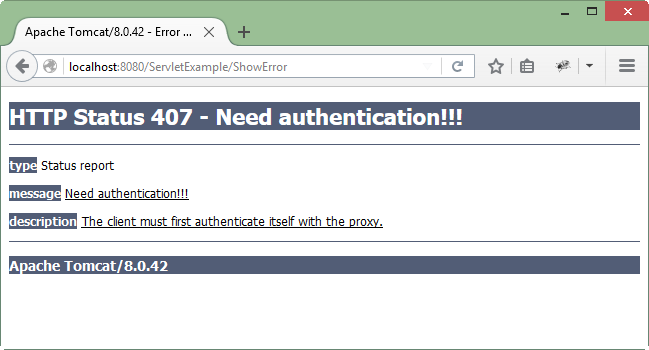

# HTTP Status Codes
Định dạng của HTTP request và HTTP response tương ứng sẽ có cấu trúc như sau:
- Môt dòng status + CRLF (Carriage Return + Line Feed nghĩa là xuống dòng).
- Không hoặc nhiều dòng header + CRLF.
- Một dòng trống, tức là một CRLF.
- Một mesage tùy chọn như tệp tin, dữ liệu truy vấn hoặc đầu ra truy vấn.

Ví dụ, máy chủ trả về một header như sau:

```
HTTP/1.1 200 OK
Content-Type: text/html
Header2: ...
...
HeaderN: ...
   (Blank Line)
<!doctype ...>
<html>
   <head>...</head>
   <body>
      ...
   </body>
</html>
```

Dòng trạng thái (status) bao gồm: phiên bản HTTP (trong ví dụ là HTTP / 1.1), mã trạng thái (HTTP Status Code - trong ví dụ là 200) và một thông báo rất ngắn tương ứng với mã trạng thái (trong ví dụ là OK).

## Danh sách HTTP Status Codes

Dưới đây là danh sách HTTP Status Codes và các message liên quan được trả về bởi Web Server.

- ** 100 - Continue**: Chỉ một phần của yêu cầu đã được nhận bởi máy chủ, nhưng miễn là nó chưa bị từ chối, khách hàng nên tiếp tục yêu cầu.
- ** 101 - Switching Protocols**: Máy chủ chuyển đổi giao thức..
- ** 200 - OK**: Yêu cầu là OK.
- ** 201 - Created**: Yêu cầu hoàn tất và tạo một tài nguyên mới.
- ** 202 - Accepted**: Yêu cầu được chấp nhận để xử lý, nhưng quá trình xử lý không hoàn thành.
- ** 203 - Non-authoritative Information**:  
- ** 204 - No Content**:  
- ** 205 - Reset Content**:  
- ** 206 - Partial Content**:  
- ** 300 - Multiple Choices**: Danh sách liên kết. Người dùng có thể chọn một liên kết và đi đến vị trí đó. Tối đa năm địa chỉ.
- ** 301 - Moved Permanently**: Trang yêu cầu đã chuyển đến một url mới.
- ** 302 - Found**: Trang được yêu cầu đã tạm thời chuyển đến một url mới.
- ** 303 - See Other**: Trang được yêu cầu có thể được tìm thấy dưới một url khác.
- ** 304 - Not Modified**:  
- ** 305 - Use Proxy**:  
- ** 306 - Unused**: Mã này đã được sử dụng trong một phiên bản trước đó. Nó không còn được sử dụng, nhưng mã được sử dụng riêng.
- ** 307 - Temporary Redirect**: Trang được yêu cầu đã tạm thời chuyển đến một url mới.
- ** 400 - Bad Request**: TMáy chủ đã không hiểu yêu cầu.
- ** 401 - Unauthorized**: Trang được yêu cầu cần tên người dùng và mật khẩu.
- ** 402 - Payment Required**: Bạn không thể sử dụng mã này.
- ** 403 - Forbidden**: Truy cập bị cấm vào trang được yêu cầu.
- ** 404 - Not Found**: Máy chủ không thể tìm thấy trang yêu cầu.
- ** 405 - Method Not Allowed**: Phương thức được chỉ định trong yêu cầu không được phép.
- ** 406 - Not Acceptable**: Máy chủ chỉ có thể tạo ra một phản ứng mà không được chấp nhận bởi khách hàng.
- ** 407 - Proxy Authentication Required**: Bạn phải xác thực với một máy chủ proxy trước khi yêu cầu này có thể được phục vụ.
- ** 408 - Request Timeout**: Yêu cầu đã lâu hơn so với máy chủ đã được chuẩn bị để chờ đợi.
- ** 409 - Conflict**: Yêu cầu không thể hoàn thành do xung đột.
- ** 410 - Gone**: Trang được yêu cầu không còn nữa.
- ** 411 - Length Required**: "Content-Length" không được định nghĩa. Máy chủ sẽ không chấp nhận yêu cầu mà không có nó.
- ** 412 - Precondition Failed**: Điều kiện tiên quyết đưa ra trong yêu cầu được đánh giá là sai bởi máy chủ.
- ** 413 - Request Entity Too Large**: Máy chủ sẽ không chấp nhận yêu cầu vì đơn vị yêu cầu quá lớn.
- ** 414 - Request-url Too Long**: Máy chủ sẽ không chấp nhận yêu cầu, vì url quá dài. Xảy ra khi bạn chuyển đổi yêu cầu "đăng" thành yêu cầu "nhận" với thông tin truy vấn dài.
- ** 415 - Unsupported Media Type**: Máy chủ sẽ không chấp nhận yêu cầu vì loại phương tiện truyền thông không được hỗ trợ.
- ** 417 - Expectation Failed**:  
- ** 500 - Internal Server Error**: Yêu cầu không hoàn thành. Máy chủ gặp một điều kiện bất ngờ.
- ** 501 - Not Implemented**: Yêu cầu không hoàn thành. Máy chủ không hỗ trợ chức năng được yêu cầu.
- ** 502 - Bad Gateway**: Yêu cầu không hoàn thành. Máy chủ nhận được phản hồi không hợp lệ từ máy chủ lưu trữ.
- ** 503 - Service Unavailable**: Yêu cầu không hoàn thành. Máy chủ đang tạm thời quá tải hoặc giảm.
- ** 504 - Gateway Timeout**: Cổng đã hết thời gian.
- ** 505 - HTTP Version Not Supported**: Máy chủ không hỗ trợ phiên bản "http protocol".

## Các phương thức thiết lập HTTP Status Code

Bạn có thể sử dụng một vài phương thức của đối tượng HttpServletResponse để thiết lập HTTP Status Code.

- **public void setStatus(int statusCode)**:Phương thức này đặt mã trạng thái tùy ý. Nếu phản hồi của bạn bao gồm mã trạng thái đặc biệt và tài liệu, hãy chắc chắn gọi setStatus trước khi thực sự trả về bất kỳ nội dung nào bằng PrintWriter.
- **public void sendRedirect(String url)**:Phương thức này tạo ra một phản hồi 302 cùng với header Location cho URL của tài liệu mới.
- **public void sendError(int code, String message)**:Phương thức này gửi mã trạng thái (thường là 404) cùng với một tin nhắn ngắn được tự động định dạng bên trong một tài liệu HTML và được gửi đến client.

## Ví dụ HTTP Status Code
Sau đây là ví dụ sẽ gửi mã lỗi 407 đến trình duyệt của client và trình duyệt sẽ hiển thị cho bạn mesage "Need authentication!!!".

Tạo file ShowError .java
```java
package vn.viettuts;
 
import java.io.IOException;
 
import javax.servlet.ServletException;
import javax.servlet.http.HttpServlet;
import javax.servlet.http.HttpServletRequest;
import javax.servlet.http.HttpServletResponse;
 
//Extend HttpServlet class
public class ShowError extends HttpServlet {
 
    // Method to handle GET method request.
    public void doGet(HttpServletRequest request, HttpServletResponse response)
            throws ServletException, IOException {
 
        // Set error code and reason.
        response.sendError(407, "Need authentication!!!");
    }
 
    // Method to handle POST method request.
    public void doPost(HttpServletRequest request, HttpServletResponse response)
            throws ServletException, IOException {
 
        doGet(request, response);
    }
}
```

Cấu hình servlet ShowError trong file web.xml

```xml
<servlet>
    <servlet-name>ShowError</servlet-name>
    <servlet-class>vn.viettuts.ShowError</servlet-class>
</servlet>
 
<servlet-mapping>
    <servlet-name>ShowError</servlet-name>
    <url-pattern>/ShowError</url-pattern>
</servlet-mapping> 
```

Gọi servlet trên sẽ tạo ra kết quả sau:

