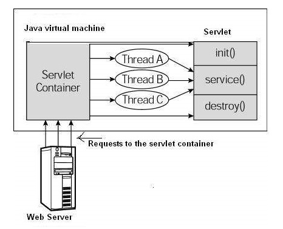

# Vòng đời Servlet

Một vòng đời của servlet có thể được định nghĩa là toàn bộ quá trình từ khi tạo ra đến khi hủy. Sau đây là tổng quan về vòng đời của servlet:
- Servlet được khởi tạo bằng cách gọi phương thức init ().
- Phương thức servlet service() được gọi để xử lý yêu cầu của khách hàng.
- Servlet được hủy bằng cách gọi phương thức destroy().
- Cuối cùng, servlet được thu thập bởi bộ sưu tập rác của JVM.

Dưới đây là chi tiết về các phương thức trong vòng đời của serv

## Phương thức init()
Phương thức init() được gọi chỉ một lần để khởi tạo servlet. Vì vậy, nó được sử dụng cho khởi tạo một lần, giống như với các phương thức init của applet.

Servlet thường được tạo khi người dùng lần đầu tiên gọi một URL tương ứng với servlet, nhưng bạn cũng có thể chỉ định rằng servlet được tải khi máy chủ được khởi động lần đầu tiên.

Khi một người dùng gọi một servlet, một thể hiện duy nhất của mỗi servlet sẽ được tạo ra, với mỗi yêu cầu của người dùng tạo ra một luồng mới được trao cho doGet hoặc doPost. Phương thức init() chỉ đơn giản tạo hoặc tải một số dữ liệu sẽ được sử dụng trong suốt vòng đời của servlet.

Định nghĩa phương thức init giống như thế này:
```java
public void init() throws ServletException {
   // Initialization code...
}
```

## Phương thức service()
Phương thức service() là phương thức chính để thực hiện nhiệm vụ thực tế. Bộ chứa servlet (tức là web server) gọi phương thức service() để xử lý các yêu cầu đến từ khách hàng (trình duyệt) và trả về kết quả.

Mỗi lần máy chủ nhận được một yêu cầu cho một servlet, máy chủ sẽ tạo ra một luồng mới và gọi phương thức service(). Phương thức service() kiểm tra kiểu yêu cầu HTTP (GET, POST, PUT, DELETE, v.v.) và gọi các phương thức doGet, doPost, doPut, doDelete, vv.

Đây là khai báo của phương thức này:
```java
public void service(ServletRequest request, ServletResponse response) 
   throws ServletException, IOException {
}
```

Phương thức service() được gọi bởi phương thức container và service gọi các phương thức doGet, doPost, doPut, doDelete, vv. Vì vậy, bạn không cần phải làm gì với phương thức service() nhưng bạn phải ghi đè phương thức doGet() hoặc doPost() phụ thuộc vào loại yêu cầu bạn nhận được từ khách hàng.

Các phương thức doGet() và doPost() là các phương thức được sử dụng phổ biến nhất để đáp ứng yêu cầu của máy khách. Dưới đây là khai báo của hai phương thức này.

## Phương thức doGet()
Một yêu cầu GET xuất phát từ một yêu cầu bình thường cho một URL hoặc từ một HTML Form mà không có METHOD chỉ định và nó phải được xử lý bằng phương thức doGet().
```java
public void doGet(HttpServletRequest request, HttpServletResponse response)
   throws ServletException, IOException {
   // Servlet code
}
```

## Phương thức doPost()
Yêu cầu POST xuất phát từ một HTML Form cụ thể mà có METHOD là POST và nó phải được xử lý bởi phương thức doPost().
```java
public void doPost(HttpServletRequest request, HttpServletResponse response)
   throws ServletException, IOException {
   // Servlet code
}
```

## Phương thức destroy()
Phương thức destroy() chỉ được gọi một lần vào cuối chu kỳ sống của một servlet. Phương thức này cho phép servlet đóng kết nối cơ sở dữ liệu, chặn các luồng chạy gầm, viết các cookie hoặc đếm số lượt truy cập và thực hiện các hoạt động dọn dẹp khác.

Sau khi phương thức destroy() được gọi, đối tượng servlet được đánh dấu để thu gom rác. Phương thức destroy() được định nghĩa như sau:
```java
public void destroy() {
   // Finalization code...
}
```

## Sơ đồ kiến trúc
Hình dưới đây mô tả vòng đởi của servlet điển hình:
- Đầu tiên các yêu cầu HTTP đến máy chủ được ủy quyền cho bộ chứa servlet.
- Bộ chứa servlet tải servlet trước khi gọi phương thức service().
- Sau đó, servlet container xử lý nhiều yêu cầu bằng cách sinh ra nhiều luồng, mỗi luồng thực hiện service() của một thể hiện duy nhất của servlet.

