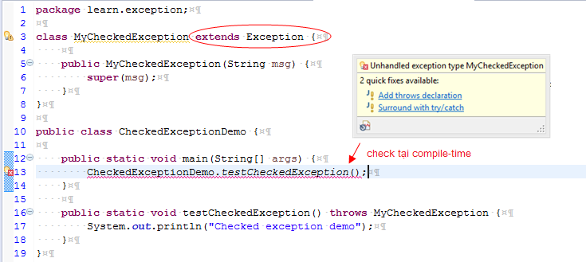
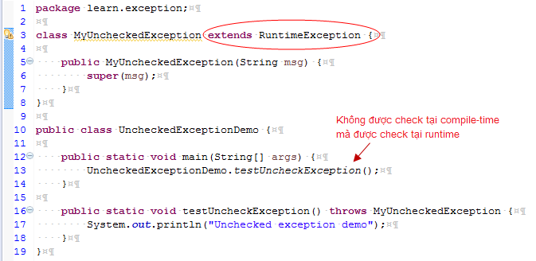

# Xử lý ngoại lệ trong java
Exception Handling trong java hay xử lý ngoại lệ trong java là một cơ chế mạnh mẽ để xử lý các lỗi runtime để có thể duy trì luồng bình thường của ứng dụng.

## Exception là gì?
Trong java, ngoại lệ là một sự kiện làm gián đoạn luồng bình thường của chương trình. Nó là một đối tượng được ném ra tại runtime.

## Exception Handling là gì?
Exception Handling (xử lý ngoại lệ) là một cơ chế xử lý các lỗi runtime như ClassNotFound, IO, SQL, Remote, vv

## Lợi thế của Exception Handling trong java
Lợi thế cốt lõi của việc xử lý ngoại lệ là duy trì luồng bình thường của ứng dụng. Ngoại lệ thường làm gián đoạn luồng bình thường của ứng dụng đó là lý do tại sao chúng ta sử dụng xử lý ngoại lệ. 
> Ví dụ: Hãy xem xét kịch bản sau: Giả sử có 10 câu lệnh trong chương trình của bạn và xảy ra trường hợp ngoại lệ ở câu lệnh 5, phần còn lại của chương trình sẽ không được thực thi, nghĩa là câu lệnh 6 đến 10 sẽ không chạy. Nếu chúng ta thực hiện xử lý ngoại lệ, phần còn lại của câu lệnh sẽ được thực hiện. Đó là lý do tại sao chúng ta sử dụng xử lý ngoại lệ trong java.

```java
statement 1;
statement 2;
statement 3;
statement 4;
statement 5; //ngoại lệ xảy ra
statement 6;
statement 7;
statement 8;
statement 9;
statement 10;
```

## Hệ thống cấp bậc của các lớp ngoại lệ trong Java


## Các kiểu của ngoại lệ
Có hai loại ngoại lệ chính là: checked và unchecked. Còn Sun Microsystem nói rằng có ba loại ngoại lệ:
- Checked Exception
- Unchecked Exception
- Error

## Sự khác nhau giữa các ngoại lệ checked và unchecked
### 1. Checked Exception
- Các lớp extends từ lớp Throwable ngoại trừ RuntimeException và Error được gọi là checked exception
- Các checked exception được kiểm tra tại compile-time.
> Ví dụ: Exception, SQLException vv. 

> Ví dụ: ta có hàm testCheckedException() ném ra một ngoại lệ được extends từ lớp Exception, nên khi nó được gọi ra trong hàm main, trình biên dịch sẽ check(báo lỗi) tức là trình biên dịch sẽ nói ràng hàm này có ném lỗi ra đấy phải xử lý lỗi đi.



### 2. Unchecked Exception
- Các lớp extends từ RuntimeException được gọi là unchecked exception, 
- Các ngoại lệ unchecked không được kiểm tra tại compile-time mà chúng được kiểm tra tại runtime.
> Ví dụ: ArithmeticException, NullPointerException, ArrayIndexOutOfBoundsException,... 

> Ví dụ: ta có hàm testUncheckedException() ném ra một ngoại lệ được extends từ lớp RuntimeException, nên khi nó được gọi ra trong hàm main, trình biên dịch sẽ không check (không báo lỗi). Mà khi chạy nếu có lỗi sẽ bắn ra tại runtime.



### 3. Error
Error là lỗi không thể cứu chữa được, 
> Ví dụ: OutOfMemoryError, VirtualMachineError, AssertionError, vv

## Các kịch bản phổ biến nơi ngoại lệ có thể xảy ra
Có một số kịch bản mà ngoại lệ unchecked có thể xảy ra. Như các trường hợp sau:
1. Kịch bản ArithmeticException: Nếu chúng ta chia bất kỳ số nào cho số 0, xảy ra ngoại lệ ArithmeticException.
```java
int a=50/0;//ArithmeticException
```
2. Kịch bản NullPointerException: Nếu chúng ta có bất kỳ biến nào có giá trị null , thực hiện bất kỳ hoạt động nào bởi biến đó sẽ xảy ra ngoại lệ NullPointerException.

```java
String s=null;  
System.out.println(s.length());//NullPointerException
```
3. Kịch bản NumberFormatException: Sự định dạng sai của bất kỳ giá trị nào, có thể xảy ra NumberFormatException. 
> Ví dụ: Giả sử ta có một biến String có giá trị là các ký tự, chuyển đổi biến này thành số sẽ xảy ra NumberFormatException
```java
String s="abc";  
int i=Integer.parseInt(s);//NumberFormatException  
```
4. Kịch bản ArrayIndexOutOfBoundsException xảy ra
Nếu bạn chèn bất kỳ giá trị nào vào index sai, sẽ xảy ra ngoại lệ ArrayIndexOutOfBoundsException.
```java
int a[]=new int[5];  
a[10]=50; //ArrayIndexOutOfBoundsException  
```

## Các từ khóa xử lý ngoại lệ trong java
Có 5 từ khóa được sử dụng để xử lý ngoại lệ trong java, đó là:
- try
- catch
- finally
- throw
- throws


