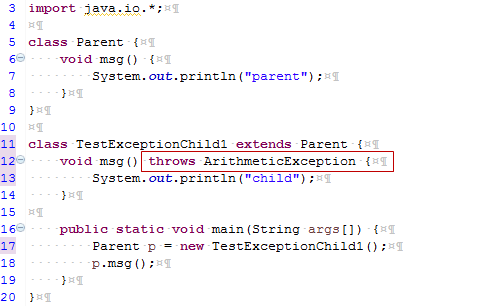
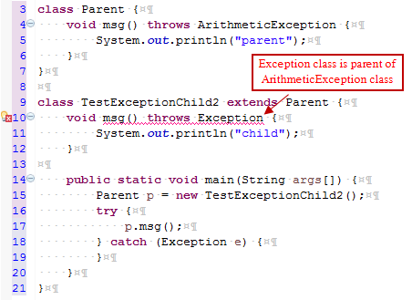
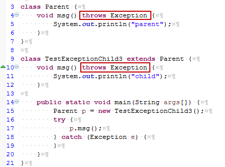
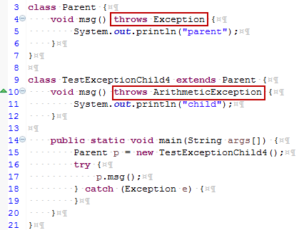
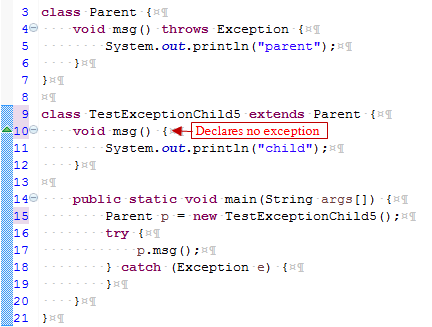

# Exception handling với overriding trong java

Có một vài quy tắc về xử lý ngoại lệ (exception handling) với overriding phương thức trong java như sau:

- **Nếu phương thức của lớp cha không khai báo ném ra exception**: Nếu phương thức của lớp cha không khai báo ném ra exception, phương thức được ghi đè của lớp cha không thể khai báo ném ra ngoại lệ checked, nhưng ngoại lệ unchecked thì có thể.

- **Nếu phương thức của lớp cha khai báo ném ra exception**: Nếu phương thức của lớp cha khai báo ném ra exception, phương thức được ghi đè của lớp cha có thể khai báo ném ra ngoại lệ tương tự, ngoại lệ con, nhưng không thể khai báo ném ra ngoại lệ cha.

> Ví dụ 1: Nếu phương thức của lớp cha không khai báo ném ra exception, phương thức được ghi đè của lớp cha không thể khai báo ném ra ngoại lệ checked.

```java
import java.io.*;
class Parent {
    void msg() {
        System.out.println("parent");
    }
}

class TestExceptionChild extends Parent {
    void msg() throws IOException {
        System.out.println("TestExceptionChild");
    }

    public static void main(String args[]){
        Parent p = new TestExceptionChild();
        p.msg();
    }
}
```
```
Compile Time Error
```

> Ví dụ 2: Nếu phương thức của lớp cha không khai báo ném ra exception, phương thức được ghi đè của lớp cha không thể khai báo ném ra ngoại lệ checked, nhưng ngoại lệ unchecked thì có thể.


```
child
```

> Ví dụ 3: Trường hợp phương thức ghi đè của lớp cha khai báo ném ra ngoại lệ cha.

```
Compile Time Error
```

> Ví dụ 4: Trường hợp phương thức ghi đè của lớp cha khai báo ném ra ngoại lệ tương tự.

```
child
```

> Ví dụ 5: Trường hợp phương thức ghi đè của lớp cha khai báo ném ra ngoại lệ con.

```
child
```

> Ví dụ 6: Trường hợp phương thức ghi đè của lớp cha không khai báo ném ra ngoại lệ nào.

```
child
```